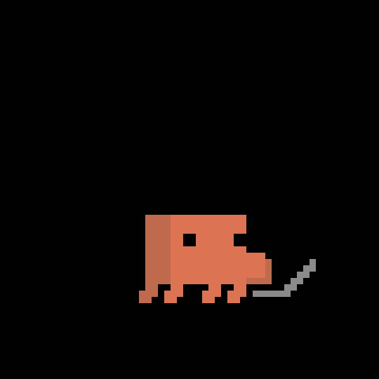
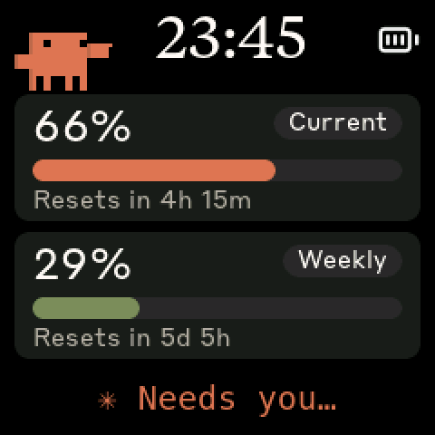

> [!IMPORTANT]
> ## This is a fork
>
> The Clawdmeter — the device, the firmware, the board ports, the BLE service,
> the animation engine — is
> **[Hermann Björgvin's](https://github.com/HermannBjorgvin/Clawdmeter)**
> project. This fork collects work from three forks of it,
> plus additions of its own, so the device shows *what Claude Code is doing*
> rather than only how fast the quota burns:
>
> - **[juppeee's `csb-buddy`](https://github.com/juppeee/Clawdmeter/tree/csb-buddy)**
>   — a payload field (`a`) that lets the host name the animation. (Its five
>   extra claudepix-based sprites are replaced here by official art, below.)
> - **[WHerzog-Germany's `csb-buddy`](https://github.com/WHerzog-Germany/Clawdmeter/tree/csb-buddy)**
>   — BLE fixes (advertising that restarts itself, no owner claimed from a
>   failed handshake, a per-board name like `Clawdmeter 35F9`), a USB plug-in
>   animation, the Waveshare Knob-1.8 port with a round layout, and a daemon
>   that reports a used-up limit instead of going quiet. On the LCD-1.54 the
>   picture is turned a quarter turn left (the board stands on its long edge),
>   the key labelled PWR now has the PWR role (GPIO 5), and the battery icon
>   shows charging.
> - **[ryanmaule's `csb-buddy`](https://github.com/ryanmaule/Clawdmeter/tree/csb-buddy)**
>   — three display modes (usage, Clawd, or Clawd for a few seconds on each
>   state change), an animated corner buddy, and a footer that says
>   `Needs you`, `Your turn`, `Limit reached` or `Idle`.
> - **Here:** the macOS and Windows daemons drive all of that themselves from
>   Claude Code hooks — no Session Browser needed. `./install-mac.sh` and
>   `install-windows.ps1` offer to install the hooks, and out of the box the
>   device then shows the clock, the corner Clawd following Claude Code, and
>   the big animation for a few seconds on each state change. Hooks later, by
>   hand:
>
>   ```bash
>   daemon/.venv/bin/python daemon/clawd_activity.py --install        # macOS
>   .venv\Scripts\python.exe daemon\clawd_activity.py --install       # Windows
>   ```
>
>   All of it can be turned off in `~/.config/claude-usage-monitor/config`
>   (`%LOCALAPPDATA%\Clawdmeter\config` on Windows; `clock`, `activity`,
>   `screen_mode`, `corner_buddy` — see
>   [`daemon/config.example`](daemon/config.example)).
> - **Here, too:** upstream's official Clawd animations and corner mascot,
>   with the fork's features carried over to that engine, plus one more
>   official animation found by name probing (`Clawd-Book.gif`). Claude Code's
>   state maps onto official art only — see
>   [What Clawd shows](#what-clawd-shows-this-fork) for which picture means what.
>
>   With `corner_buddy = on` the corner mascot plays the same state in place
>   of its own routine. Also from upstream: the daemon token fixes, the
>   LCD-4 port and the desktop simulator.
>
> Tested on a Waveshare ESP32-S3-Touch-LCD-1.54 and in the simulator.
> The [Claude Session Browser](https://github.com/juppeee/claude-session-browser)
> sends the same fields on Windows; the Linux daemon only sends usage.
>
> No licence, here or upstream. Hermann explains why in
> [his README](https://github.com/HermannBjorgvin/Clawdmeter#licensing-gray-area-warning).
> Anything broken here is this fork's doing, not Hermann's — open an issue
> here, not on his tracker.
>
> The rest of this README is upstream's.

# Clawdmeter


A small ESP32 dashboard I made for my desk to keep an eye on Claude Code usage.

It runs on a [Waveshare ESP32-S3-Touch-AMOLED-2.16](https://www.waveshare.com/esp32-s3-touch-amoled-2.16.htm?&aff_id=149786) as well as a few other alternative boards and pairs over Bluetooth, the splash screen plays pixel-art Clawd animations that get
busier when your usage rate climbs. The two side buttons send Space and
Shift+Tab over BLE HID for Claude Code's voice mode and mode-toggle shortcuts.

|              Usage meter              |              Clawd animation screen              |
| :-----------------------------------: | :----------------------------------------------: |
|  |  |

The Clawd animations are Anthropic's official pixel art — see [Credits](#credits).

## Screens

The device boots into the splash. Tap the screen anywhere to switch to the Usage view; tap again to flip back to the splash.

| Splash | Usage |
| :----: | :---: |
|  |  |
| Splash: official Clawd on the laptop while Claude Code runs a tool | Usage: corner mascot pointing, footer saying Claude needs your permission |

<sub>Captured from an ESP32-S3-Touch-LCD-1.54 running this branch, with the macOS daemon's default settings.</sub>

While the splash is up, the middle (PWR) button cycles animations. **Hold the power button for 3 seconds, then release, to put the device into pairing mode** — this clears the saved Bluetooth bond and re-advertises. The firmware also auto-rotates animations every 20 s within the current usage-rate group, so a long stretch on the splash isn't just one Clawd on loop.

## What Clawd shows (this fork)

Once the Claude Code hooks are installed (`install-mac.sh` and
`install-windows.ps1` offer them; the daemon's `activity = auto` default then
switches on), they tell the device
what each session is doing, and Clawd acts it out — on the splash,
in the corner of the usage screen (`corner_buddy = on`), and in the footer.
With several sessions open, the most urgent one wins: limit, then permission,
then working, then done.

| Clawd | State | When | Footer |
| :---: | --- | --- | --- |
|  | **Working** | Claude runs a tool (Bash, search, …) or edits a file (Edit, Write) | rotating verbs |
|  | **Thinking** | you sent a prompt, or a tool just finished and Claude is deciding what's next | rotating verbs |
|  | **Needs you** | Claude is waiting for your permission to run a tool, or has asked you a question | **Needs you** (amber) |
|  | **Your turn** | Claude finished its reply — for 3 minutes, then idle | **Your turn** (green) |
|  | **Out of quota** | the 5-hour or the weekly limit is at 100 % | **Limit reached** (red) |
|  | **Sleeping** | no Claude Code activity for 15 minutes | **Idle** (gray) |
| — | **Idle** | between those, or with `activity = off` | **Idle** / rotating verbs |

While idle, the device picks its own animations by how fast your quota is
burning, as upstream does: calm ones (magnifier, walking, book, …) when usage
is flat, busier ones (dancing, skateboard, racing car, …) as it climbs.

Details worth knowing:

- **Display mode** (`screen_mode`): `usage` keeps the numbers up and lets the
  corner and footer carry the state; `clawd` shows the big animation all the
  time; `auto` (default) shows the numbers and switches to the big animation
  for 6.5 s whenever the state changes.
- Flips between working and thinking are held for at least 4 s so the screen
  doesn't flicker during a turn; *Needs you*, *Your turn* and *Out of quota*
  go out at once.
- A turn interrupted with Esc fires no hook of its own, so a working state
  falls back to idle after 5 minutes without news.
- Switches always pass through Clawd's shared idle pose, so the big animation
  may finish its current move (a second or two) before showing the new state.
- The Windows [Claude Session Browser](https://github.com/juppeee/claude-session-browser)
  sends the same state names and gets the same pictures.

### Sounds

On boards with a speaker (LCD-1.54, AMOLED-2.16, AMOLED-1.8) the device also
plays a short cue on the state changes that want you:

| Sound | When |
| --- | --- |
| two equal knocks | Claude needs your permission — once more after 2 minutes if you haven't reacted |
| three rising notes | your turn — only when Claude was actually working before |
| three low falling notes | the 5-hour or weekly limit is reached |
| bell | the 5-hour limit has reset (`chime = on`) |
| one blip / rising two-tone | hold-to-pair: "release now" / "paired" |

The state cues are on by default; `state_sounds = off` in the daemon config
silences them. `volume = 0..100` (default 70) sets the level of every sound,
in percent of the board's full level; the device remembers it across reboots. The first state after boot or a reconnect never sounds. The
serial commands `buzz`, `beep needs`, `beep turn`, `beep limit`, `beep armed`
and `beep paired` play each one on demand.

## Hardware

Boards supported out of the box:

- [Waveshare ESP32-S3-Touch-AMOLED-2.16](https://www.waveshare.com/esp32-s3-touch-amoled-2.16.htm?&aff_id=149786)
- [Waveshare ESP32-C6-Touch-AMOLED-2.16](https://www.waveshare.com/esp32-c6-touch-amoled-2.16.htm?&aff_id=149786) 
- [Waveshare ESP32-S3-Touch-AMOLED-1.8](https://www.waveshare.com/esp32-s3-touch-amoled-1.8.htm?&aff_id=149786)
- [Waveshare ESP32-C6-Touch-AMOLED-1.8](https://www.waveshare.com/esp32-c6-touch-amoled-1.8.htm?&aff_id=149786)
- [Waveshare ESP32-S3-Touch-AMOLED-2.06](https://www.waveshare.com/esp32-s3-touch-amoled-2.06.htm?&aff_id=149786)
- [Waveshare ESP32-S3-Touch-LCD-1.54](https://www.waveshare.com/esp32-s3-lcd-1.54.htm?sku=33869) (240x240 SPI TFT, not AMOLED)
- [Waveshare ESP32-S3-Touch-LCD-4](https://www.waveshare.com/esp32-s3-touch-lcd-4.htm) (480x480 RGB TFT)
- [Waveshare ESP32-S3-Knob-Touch-LCD-1.8](https://www.waveshare.com/esp32-s3-knob-touch-lcd-1.8.htm) (round, rotary ring; this fork only)

> Please check if a pull request exists for your alternative hardware port before opening a new one, providing QA feedback and testing on the same hardware is more valuable than duplicate pull requests.

**Porting to another board:** the firmware is a thin HAL with per-board folders under `firmware/src/boards/`. Drop in a new folder and a new PlatformIO env — `main.cpp`, `ui.cpp`, and `splash.cpp` never need to change. See [`docs/porting/adding-a-board.md`](docs/porting/adding-a-board.md) for the walk-through and [`docs/porting/hal-contract.md`](docs/porting/hal-contract.md) for the interfaces a port must implement.

## Prerequisites

- Linux (tested on Ubuntu), macOS, or Windows 10/11
- [PlatformIO CLI](https://docs.platformio.org/en/latest/core/installation/index.html)
- Linux: `curl`, `bluetoothctl`, `busctl` (BlueZ Bluetooth stack)
- macOS: `python3` (the installer sets up a venv with `bleak` and `httpx`)
- Windows: `python3` 3.11+ (the installer sets up a venv with `bleak`, `httpx`, and `pystray`)
- Claude Code with an active subscription

## macOS installation

The macOS host pieces — Python daemon, LaunchAgent, and flash helper — were ported by [Chris Davidson (@lorddavidson)](https://github.com/lorddavidson). Thanks Chris!

### Flash the firmware

```bash
./flash-mac.sh waveshare_amoled_216                       # auto-detects /dev/cu.usbmodem*
./flash-mac.sh waveshare_amoled_18  /dev/cu.usbmodem1101  # or pass an explicit USB serial port
```

The board env name is required. Run `./flash-mac.sh` with no args to see the available envs (scraped from `firmware/platformio.ini`).

### Pair the device

After flashing, open **System Settings → Bluetooth** and click *Connect* next to "Clawdmeter XXXX" (every board appends the last four hex digits of its Bluetooth address). The daemon only ever connects to the peripheral this Mac is paired/connected to — it never scans for a nearby device — so once it's connected here the daemon picks it up on its next poll (~60 s).

### Install the daemon

The daemon reads your Claude OAuth token from the macOS Keychain (service `Claude Code-credentials`), polls usage every 60 s, and pushes it to the display over BLE.

```bash
./install-mac.sh
```

The installer creates a Python venv in `daemon/.venv/`, installs `bleak` and `httpx`, renders a LaunchAgent into `~/Library/LaunchAgents/com.user.claude-usage-daemon.plist`, and loads it. The first run is launched interactively so macOS prompts for Bluetooth permission.

Useful commands:

```bash
launchctl list | grep claude-usage                                          # check it's running
tail -F ~/Library/Logs/claude-usage-daemon.out.log                          # live logs
launchctl unload ~/Library/LaunchAgents/com.user.claude-usage-daemon.plist  # stop
launchctl load -w ~/Library/LaunchAgents/com.user.claude-usage-daemon.plist # start
```

## Linux installation

### Flash the firmware

```bash
./flash.sh waveshare_amoled_216                  # defaults to /dev/ttyACM0
./flash.sh waveshare_amoled_18  /dev/ttyACM1     # or pass an explicit USB serial port
```

The board env name is required. Run `./flash.sh` with no args to see the available envs (scraped from `firmware/platformio.ini`).

### Pair the device

After flashing, the device advertises as "Clawdmeter XXXX" (the last four hex digits of its Bluetooth address). Pair it once:

```bash
# Scan for the device
bluetoothctl scan le

# When "Clawdmeter XXXX" appears, pair and trust it
bluetoothctl pair F4:12:FA:C0:8F:E5    # use your device's MAC
bluetoothctl trust F4:12:FA:C0:8F:E5
```

To re-pair later, hold the power button for 3 seconds then release — the device clears its saved bond and re-advertises.

### Install the daemon

The daemon polls your Claude usage every 60 seconds and sends it to the display over BLE.

```bash
./install.sh
systemctl --user start claude-usage-daemon
```

Check status: `systemctl --user status claude-usage-daemon`

View logs: `journalctl --user -u claude-usage-daemon -f`

## Windows installation

Runs natively on Windows — no WSL required. A system-tray app polls your usage and pushes it over BLE, and starts automatically at login.

### Prerequisites

- **Native Windows** (not WSL).
- **Python 3.11+** from [python.org](https://www.python.org/downloads/) — check *"Add python.exe to PATH"* during install.
- **Claude Code** installed, with `claude login` completed. The token is read from `%USERPROFILE%\.claude\.credentials.json` (falling back to `%LOCALAPPDATA%\Claude\` then `%APPDATA%\Claude\`).
- The repo on a **native Windows path** (e.g. `%USERPROFILE%\Clawdmeter`), **not** a `\\wsl$` share — the installer refuses a WSL path.

### Flash the firmware

```powershell
pio run -d firmware -e waveshare_amoled_216 -t upload --upload-port COM5   # use your device's COM port
```

Run `pio run -d firmware` with no env to see the available board envs.

If the very first build stops at `Failed to install Python dependencies`, the pioarduino platform tried to reinstall its own `platformio` into the running `pio.exe`'s environment, which Windows does not allow. Install the packages listed in `python_deps` (`%USERPROFILE%\.platformio\platforms\espressif32\builder\penv_setup.py`) into that environment by hand with its `uv.exe pip install --python=<penv>\Scripts\python.exe …`, then build again.

### Pair the device

The device is a bonded BLE HID keyboard, so pair it once: **Settings → Bluetooth & devices → Add device → Bluetooth**, then select "Clawdmeter XXXX". Pairing is **required** — it enables the physical buttons and keeps a persistent connection (the device keeps showing your last-synced usage even after the daemon quits). To undo, use **Remove device** (this disables the buttons).

### Install the daemon (recommended)

From the repo root in PowerShell:

```powershell
powershell -ExecutionPolicy Bypass -File install-windows.ps1
```

This creates a venv, installs `bleak`/`httpx`/`pystray`/`Pillow` from the in-repo requirements (no internet downloads), offers the Claude Code hooks that let the device show what Claude is doing (default yes — see [What Clawd shows](#what-clawd-shows-this-fork)), registers a per-user login-autostart entry (`HKCU\…\Run`, no admin needed), and launches the tray app headlessly (no console window).

The hooks run `clawd_activity.py` through the base interpreter's `pythonw.exe`, so no console window flashes on each tool call; they write one small file per session to `%LOCALAPPDATA%\Clawdmeter\activity`. Remove them with `.venv\Scripts\python.exe daemon\clawd_activity.py --uninstall`.

### Run manually instead (optional)

```powershell
python -m venv .venv
.venv\Scripts\Activate.ps1        # if blocked: Set-ExecutionPolicy -Scope CurrentUser RemoteSigned, then retry
pip install -r daemon\requirements-windows.txt
python daemon\claude_usage_daemon_windows.py        # runs in the foreground; Ctrl+C to stop
```

### Tray icon and menu

The icon's corner bubble shows state — **green** Connected, **amber** Scanning, **red** Error — and hovering shows the status (`Connected · last update HH:MM`). A notification fires once when it enters Error (e.g. an expired token). Right-click for the menu:

- **Status header** — live state + last sync time.
- **Start at login** — toggle autostart on/off.
- **Quit** — stops the daemon cleanly; leaves the Windows pairing intact (device keeps its last reading).

### Logs and troubleshooting

```powershell
Get-Content $env:LOCALAPPDATA\Clawdmeter\daemon.log -Tail 30        # view logs
reg delete "HKCU\Software\Microsoft\Windows\CurrentVersion\Run" /v Clawdmeter /f   # remove autostart
```

| Symptom | Fix |
|---------|-----|
| `Device not found` | Power on the device; make sure it's in range and paired. |
| `token expired` toast / `API HTTP 401` | Re-run `claude login`, then restart the daemon. |
| `Connection failed` | Toggle Windows Bluetooth off/on in Settings. |
| `Warning: running under Linux/WSL` | Run from a native PowerShell window, not a WSL shell. |

## How it works


1. The daemon reads your Claude Code OAuth token — from the macOS Keychain (service `Claude Code-credentials`) on macOS, or from `~/.claude/.credentials.json` on Linux (`%USERPROFILE%\.claude\.credentials.json` on Windows).
2. It makes a minimal API call to `api.anthropic.com/v1/messages` — one token of Haiku, basically free.
3. The usage numbers come straight out of the response headers (`anthropic-ratelimit-unified-5h-utilization` and friends).
4. The daemon connects to the ESP32 over BLE and writes a JSON payload to the GATT RX characteristic.
5. The firmware parses it and updates the LVGL dashboard.
6. The firmware also tracks the rate of change of session % over a 5-minute window and picks splash animations from the matching mood group.
   With the Claude Code hooks installed (macOS and Windows daemons, this fork), they report what each session is doing instead, and the daemon sends that as the animation name — thinking, writing, waiting for your permission, done, out of quota.
7. The two side buttons are independent of all of this — they send Space and Shift+Tab as BLE HID keyboard input to the paired host directly.

## Physical buttons

The board has three side buttons. Left and right send HID keys; the middle (PWR) button cycles splash animations and, held for 3 seconds, triggers pairing mode.

| Button           | GPIO         | Function                                                       |
| ---------------- | ------------ | -------------------------------------------------------------- |
| **Left**         | GPIO 0       | Hold to send Space (Claude Code voice-mode push-to-talk)       |
| **Middle** (PWR) | AXP2101 PKEY | On splash: cycle animations. Hold 3s + release: pairing mode |
| **Right**        | GPIO 18      | Press to send Shift+Tab (Claude Code mode toggle)              |

Space and Shift+Tab go out as standard BLE HID keyboard reports, so they trigger in whatever window has focus on the paired host — not just Claude Code.

## BLE protocol

The device advertises a custom GATT service alongside the standard HID keyboard service:

|                            | UUID                                   |
| -------------------------- | -------------------------------------- |
| **Data Service**           | `4c41555a-4465-7669-6365-000000000001` |
| RX Characteristic (write)  | `4c41555a-4465-7669-6365-000000000002` |
| TX Characteristic (notify) | `4c41555a-4465-7669-6365-000000000003` |
| **HID Service**            | `00001812-0000-1000-8000-00805f9b34fb` |

JSON payload format (written to RX):

```json
{ "s": 45, "sr": 120, "w": 28, "wr": 7200, "st": "allowed", "ok": true }
```

Fields: `s` = session %, `sr` = session reset (minutes), `w` = weekly %, `wr` = weekly reset (minutes), `st` = status, `ok` = success flag.

Optional fields (all may be omitted):

| Field | Meaning |
| ----- | ------- |
| `c`  | `1` = play the chime when the session limit resets |
| `t`, `tf` | local wall-clock epoch and hour format (12/24) for the clock |
| `a`  | animation name to play, e.g. `"work coding"`, `"allow"`, `"done"`, `"limit"` (this fork; `""` = device picks by usage rate) |
| `sm` | display mode: `0` usage, `1` Clawd, `2` Clawd briefly on each state change (this fork) |
| `ua` | `true` = animate the buddy in the usage screen's corner (this fork) |

## Development


- **Desktop simulator** — iterate on the UI without hardware: an SDL2 window
  runs the full firmware loop with scenario playback (`pio run -d firmware -e
sim`, then `cd firmware && .pio/build/sim/program`). See
  [`SIM-USAGE.md`](SIM-USAGE.md) for controls, scenarios, and headless
  screenshots.
- **Splash animations** — Anthropic's official Clawd sprites, archived with
  provenance notes in [`research/clawd-official/`](research/clawd-official/);
  `node tools/convert_official_clawd.js` regenerates
  `firmware/src/splash_animations.h`. See [`tools/README.md`](tools/README.md).
- **Icons** — Lucide PNGs convert to LVGL C arrays with
  `tools/png_to_lvgl.js`. See [`tools/README.md`](tools/README.md).
- **Fonts** — the pre-compiled LVGL fonts and the LVGL-9 patching they need:
  [`docs/fonts.md`](docs/fonts.md).
- **Porting** — [`docs/porting/adding-a-board.md`](docs/porting/adding-a-board.md)
  and [`docs/porting/hal-contract.md`](docs/porting/hal-contract.md).

## Credits

- Pixel-art Clawd animations are Anthropic's official mascot art (claude.ai/code, Claude Code desktop), archived and converted by the tooling in `tools/` and `research/clawd-official/`.
- Lucide icon set ([lucide.dev](https://lucide.dev), MIT) for bluetooth and battery UI glyphs.
- Anthropic brand fonts (Tiempos Text, Styrene B) — see licensing warning below.

## Licensing gray area warning

The software in this repository uses and adheres to the Anthropic brand guidelines and uses the same proprietary fonts that Anthropic has a license for but this software uses without permission as well as using assets from Anthropic such as the copyrighted Clawd mascot so even though the code in this repo is non-proprietary I will not license it myself under a copyleft license since this repo includes proprietary fonts and copyrighted assets. Please be aware of this if you fork or copy the code from this repo. **You have been warned!**
